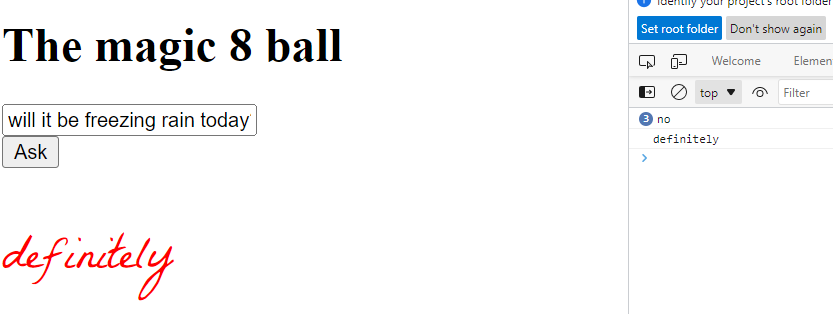

# UX220Final

Each question is worth 5 points

1. Compare and contrast the following 2 forms:

`<form action="http://localhost:3002/send/" method="post"> ... </form>`

`<form action="https://dry-bayou-18746.herokuapp.com/send/" method="post"> ... </form>`

Pay special attention to why one or the other won't work on github pages. Write a semantically formatted html file in q1.html that 
includes doctype, html, head, body, header, footer, main, h1 ("Post action attribute"), h2 ("http://localhost:3002/send/" and 
"https://dry-bayou-18746.herokuapp.com/send/") and p tags in the correct place. 
The paragraphs in the html file should contain whether each will work on github pages and why or why not.

Note: It is fine for you to just use the url of the action attribute in your level 2 headings.

2. The following code is for a simple magic 8 ball. Change the code so that:

a) before anything is typed in to the input there is a prompt in lighter text that says "ask me anything"

b) the answer is written in red text

c) the answer has twice the normal height

d) the answer is written in a handwriting font of your choosing from https://fonts.google.com



3. Put the following code in to a complete html page with a:

1) doctype declaration

2) an opening and closing tag that specifies the language of the document

3) a portion of the document that describes information about the document including the way that the viewport is scaled for mobile

4) a portion of the document that contains the content

5) add an html 5 semantic tag at the end of the document that includes a copyright notice with the year supplied by a custom element.

```
<h1>Where in the world is Rich</h1>
<p>Rich was here</p>
```